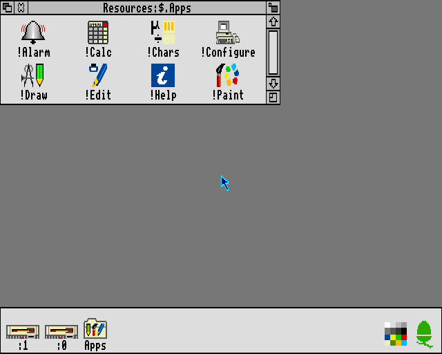
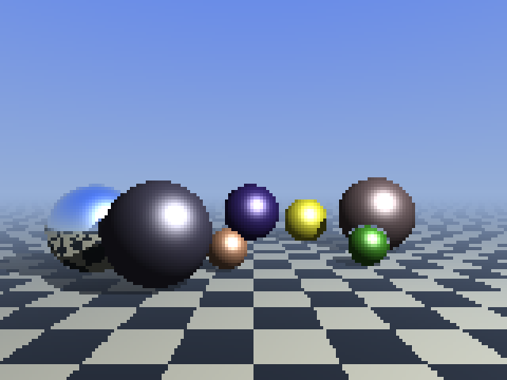

# ArchieEmu — a modular ARMv2 / Acorn Archimedes emulator

An emulator written in C99, built from modules that only talk to each other
through interfaces. It runs in two flavours:

- **`archie.exe`** — a low-level Acorn Archimedes A3000/A310: the CPU executes the
  real RISC OS 3.11 ROM and talks to emulated MEMC, IOC and VIDC chips, floppy
  drives, keyboard, mouse and sound. Original software such as Zarch, Elite and
  Pacmania runs on it.
- **`armwin.exe`** — a lightweight BBC BASIC V machine: the original BASIC module
  runs on the emulated ARM2, while the RISC OS calls it makes are handled in C,
  with a framebuffer that goes up to 32-bit truecolour.

| RISC OS 3.11 desktop | Ray tracer in BBC BASIC + ARM assembler |
|---|---|
|  |  |

```
 ┌────────────┐   ArmBus    ┌───────────┐   4 KB pages    ┌──────────────┐
 │  ARMv2 CPU │────────────▶│    Bus    │────────────────▶│ RAM / ROM    │
 │  src/cpu   │             │ src/core  │────────────────▶│ devices      │
 └─────┬──────┘             └───────────┘                 └──────────────┘
       │ SWI hook
 ┌─────▼──────────────┐
 │ RISC OS HLE (SWIs) │  OS_WriteC, OS_Write0, OS_NewLine, OS_ReadC, OS_Exit...
 │ src/hle            │
 └────────────────────┘
```

- **`src/cpu/arm2.c`**: ARMv2a (ARM2 + SWP). R15 holds both the 26-bit PC and the
  PSR, with FIQ/IRQ/SVC register banks, every exception (including address
  exceptions and aborts), TEQP and LDM `^`, S/N/I cycle counting and the 3-stage
  prefetch pipeline.
- **`src/cpu/arm2_disasm.c`**: disassembler using BBC BASIC assembler syntax.
- **`src/core/bus.c`**: 64 MB address space, direct memory or device callbacks.
- **`src/hle/riscos_swi.c`**: RISC OS SWIs executed by the host.

## Building and testing

Windows, Visual Studio 2022 and CMake:

```
cmake -S . -B build -G "Visual Studio 17 2022" -A x64
cmake --build build --config Release
build\Release\test_arm2.exe                       # 26-bit specific tests
.venv\Scripts\python tests\diff_unicorn.py        # comparison against Unicorn
.venv\Scripts\python tools\asm.py demos\primes.s build\demos\primes.bin
build\Release\armemu.exe -s build\demos\primes.bin
```

`armemu` loads a binary at &8000 and runs it in user mode. Options: `-t`
(disassembled trace), `-s` (statistics), `-a` (load address), `-m` (MB of RAM)
and `-c` (cycle limit).

The `.venv` environment contains Unicorn, Keystone and Capstone. Recreate it with
`python -m venv .venv` followed by `.venv\Scripts\pip install unicorn keystone-engine capstone`.

## Verification

- `test_arm2`: 111 checks of ARMv2-specific behaviour: R15 as Rn (PC only) and
  as Rm (PC+PSR), +12 with register-specified shifts and in STR/STM, register
  banks, exceptions and returns, IRQs, PSR protection in user mode, unaligned
  LDR, base write-back in STM, aborts and the disassembler.
- `diff_unicorn.py`: data processing and multiplication compared bit for bit with
  Unicorn (QEMU) over 1.2 million random instructions, with zero differences.
- `test_memc`, `test_vidc`, `test_kbd`, `test_cmos`, `test_fdc`: the Archimedes chips.
- `test_basic`: the complete BBC BASIC machine.

## BBC BASIC V machine

`third_party/riscos/BASIC` is the original BBC BASIC V 1.87 from RISC OS Open
(Apache 2.0), built for RISC OS 3.10: it runs on our ARMv2 CPU as a "ROM" module.
The RISC OS kernel is not emulated instruction by instruction: the SWIs BASIC
calls are executed in C (`src/riscos/kernel.c`), and output goes through a VDU
driver (`src/riscos/vdu.c`) that draws into the framebuffer at &2000000 in the
mode's native format (up to 32 bpp truecolour).

```
build\Release\armwin.exe                  # window: ARM2 clock at 8 MHz, F12 = turbo
build\Release\armwin.exe --mhz 25         # an ARM3 at 25 MHz
build\Release\armbasic.exe < listing.txt  # console, for tests
build\Release\test_basic.exe              # tests of the whole machine
```

In the window: Escape interrupts the program, Ctrl+V pastes a listing, F12
toggles between the limited clock and turbo. For truecolour use
`MODE "X640 Y480 C16M"` or `MODE 49`, then `COLOUR r,g,b` and `GCOL r,g,b`.

### Files

The disc is the project's `disc` folder (change it with `--disc`). As in
RPCEmu's HostFS, the RISC OS file type is a suffix: `SAVE "mandel"` creates
`disc\mandel,ffb`. The RISC OS `.` separates directories and `/` acts as the
extension: `mandelbrot/bas` is `mandelbrot.bas` on Windows.

- `SAVE`, `LOAD`, `CHAIN`: tokenised programs;
- `TEXTLOAD`, `TEXTSAVE`: plain text listings, editable in Notepad;
- `OPENIN`/`OPENOUT`/`OPENUP`, `PRINT#`, `INPUT#`, `BGET#`, `BPUT#`, `PTR#`, `EXT#`, `EOF#`;
- `*CAT` (or `*.`), `*EX`, `*DELETE`, `*RENAME`, `*CDIR`, `*TYPE`.

### Demo programs

In `disc`: `mandel` (Mandelbrot set), `Harmonograph`, and `Ray`, a ray tracer
with shadows, reflective spheres and a choice of screen modes. Its ray/sphere
intersection kernel is written in fixed point with the BBC BASIC inline ARM
assembler (`PROCassemble`), about 1.6× faster than pure BASIC on an 8 MHz ARM2.

| MODE 28, 256 colours (VIDC1) | MODE 49, 16M colours (emulator only) |
|---|---|
|  |  |

## Archimedes machine (original ROMs)

`archie.exe` is a low-level emulation of an Archimedes A3000/A310: the CPU runs
the real RISC OS ROM and talks to the chips, just like the real machine.

| Module | File | What it does |
|---|---|---|
| MEMC1a | `src/archie/memc.c` | page translation (CAM), PPL protection, ROM at 0 on reset, DMA |
| IOC | `src/archie/ioc.c` | IRQ/FIQ, 2 MHz timers, KART serial link, I2C pins |
| VIDC1a | `src/archie/vidc.c` | palette, 1 to 8 bpp modes, hardware cursor, sound |
| Keyboard | `src/archie/kbd.c` | keyboard microcontroller protocol, mouse |
| CMOS | `src/archie/cmos.c` | PCF8583 on I2C, clock, RISC OS checksum |
| Floppy | `src/archie/fdc.c` | WD1772 with ADFS `.adf` images, two drives |
| Machine | `src/archie/archie.c` | A310 I/O map, 24 MHz time base, events |

The ROMs go in `roms\` and are **not included**: RISC OS 3.1 is not open source.
`archie.exe` looks for `roms\1. Major\ROM311`; the CMOS is saved next to the ROM
(`ROM311.cmos`). The RISC OS 3 POST passes every test. To follow the boot:

```
build\Release\archie_boot.exe --rom "roms\1. Major\ROM311" --ms 20000 --png screen.png
```

It prints the POST report, exceptions, chip state and the code around the PC.
`--floppy` / `--floppy2` insert disc images and `--keys "{F12}*cat :0{ENTER}"`
types on the emulated keyboard.

### Timing, sound and keyboard

- **Faithful ARM2 timing**: every instruction counts the S, N and I cycles from
  the datasheet. On an 8 MHz MEMC an N cycle costs 2 ticks, ROM fetches cost the
  access time RISC OS programs (325 ns), and video DMA takes its share of the
  bandwidth (16% in 80 KB modes). The BASIC machine uses the same costs, plus the
  VDU driver's work, calibrated by running the same programs on emulated
  RISC OS 3.11: see the COST_* constants in `src/riscos/vdu.c`.
- **Sound** (`archie.exe`): MEMC DMA feeds the VIDC with logarithmic bytes, one
  every SFR+2 µs, across 8 stereo channels; the output is resampled to 48 kHz.
- **Keyboard** (`src/frontend/archie_keys.c`): letters, digits and control keys
  map by position; symbols follow the character produced by the Windows layout
  (RISC OS 3.11 has no Spanish layout), and accented letters are composed with
  Alt + keypad. Translated events are sent every 40 ms, because RISC OS samples
  the keyboard every centisecond. `test_keys_es` types with the real Windows
  Spanish layout and reads the screen back using the ROM font.
- **ARM2 pipeline**: the next two instructions are already fetched while the
  current one executes, so code that rewrites them does not see the change
  (Elite's copy protection relies on this).

`archie.exe` shortcuts:

| Keys | Action |
|---|---|
| Ctrl+F9 | choose a floppy image (with Shift: drive 1) |
| Ctrl+F8 | eject |
| Ctrl+F10 | sound on/off |
| Ctrl+F11 | release the mouse (click in the window to capture it) |
| Ctrl+F12 | turbo |
| Ctrl+Shift+F12 | reset |

Dropping an `.adf` file on the window also inserts it.

Tested software: Zarch (Play It Again Sam 2), Pacmania, Elite (launch it with a
double click from the desktop: from the F12 command line it stops with
"Wimp is currently active"), Genesis Professional 3.04 (disc 1 in :0 and disc 2,
which holds `!GenLib`, in :1; open both drive windows so the Filer sees
`!System`, `!Scrap` and `!GenLib`, then double click `!Genesis`).

`tools/mkadfs.py` builds 800 KB ADFS D images from a directory, a zip with
RISC OS file types, or a Spark/Arc archive.

## Next steps

1. Swappable ROMs for the BASIC machine (`--rom`): BASIC today, then Forth and
   other languages.
2. Hard disc and CD-ROM images.
3. Later: 32-bit ARMv3/v4 CPU and Risc PC hardware for RISC OS 5.

## Licence

The emulator code is released under the MIT licence (see `LICENSE`). The
components in `third_party/riscos` (the BBC BASIC V module) and the system font
in `src/riscos/font.h` come from RISC OS Open and remain under the Apache 2.0
licence. RISC OS 3.x ROMs and floppy images are not included and must not be
redistributed.
